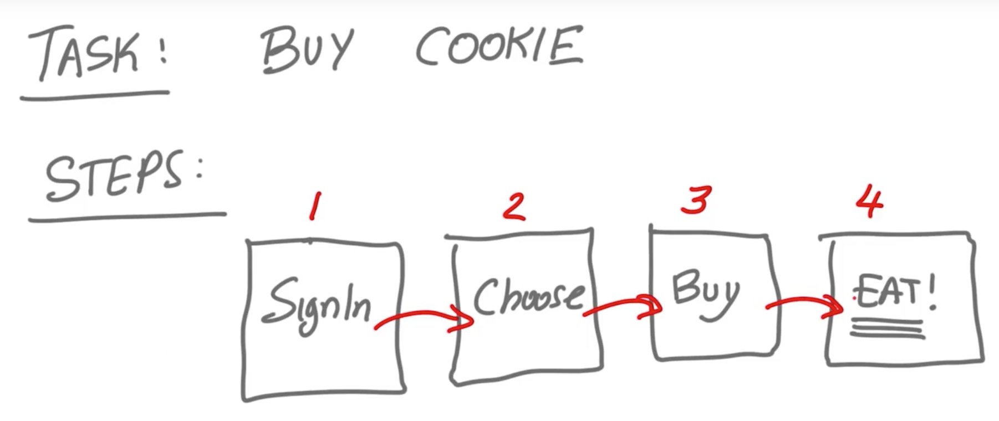

UX

> target

Make your a UX minded developer.

1. What is UX
    - Difference between UI and UX
2. User Centric Design
3. Mobile Design Constraints
4. Android Design

## What is UX?

UX design is about all of these tons of different things coming together. In software it include:
- UI
- Sound
- User Interactive
- 质量（速度，）

Design is every one's responsibility, include mine.

## How to improve user experience?

Tow example:

### Login

1. Visual Interface Design.
2. Font bigger and space a little bit wider
3. Validate the form let user know what to type in if they get something wrong.
4. Don't use it in entry.
5. Better is use third login like goole or facebook.

### checkout form

Make it easy with google or payple checkout.

## UX Design

1. Focus on UX first and big picture but not on UI detail. It also useful for develop.
2. Use wireframing or low res wireframing to ovoid focus on detail first.

etc. Imagine a cooke baying application with login and checkout out form. Here is how you really get started.

1. Imagine there is a task that your user wants to complete, For example it's I'm hungry for cookies and wants to get some and eat the cookies, basically.
2. So then you think about what steps does your user need to go through to complete this task. So this is an easy example cause we only have one task.
3. So the steps would be:
    1. Sign in.
    2. Decide which cookies you want.
    3. Pay for your cookies.
    4. Eat the cookies.
4. When we write out each of these steps at a hight level like above. Each of these steps is kind of like a Java interface. Exactly when you think about a Java interface, it's something that doesn't have any implementation. So you'er not thinking about the low level details but you're thinking about the contract that interface has with other interfaces and classes. Which in this case if you look at the steps, it's how these steps connect with each other.

5. Then we think about every step. how to make it more good experience.
