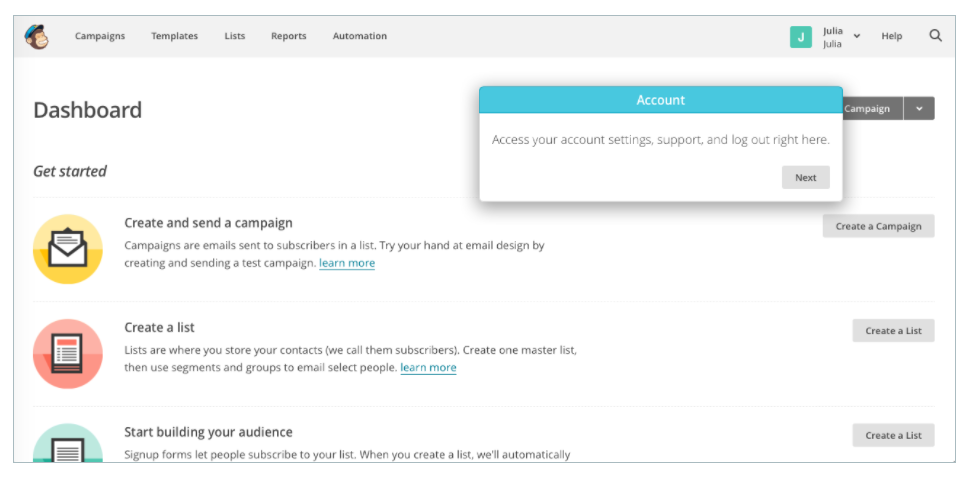
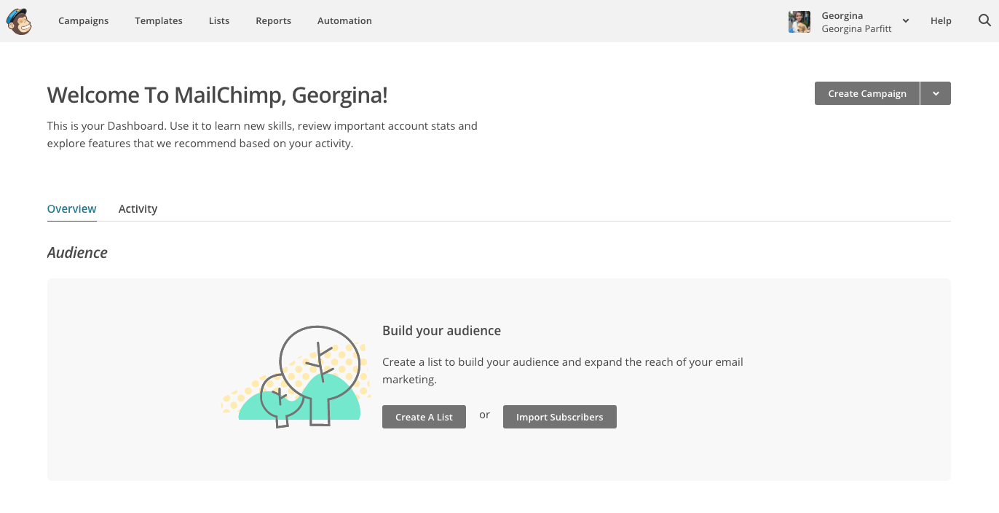
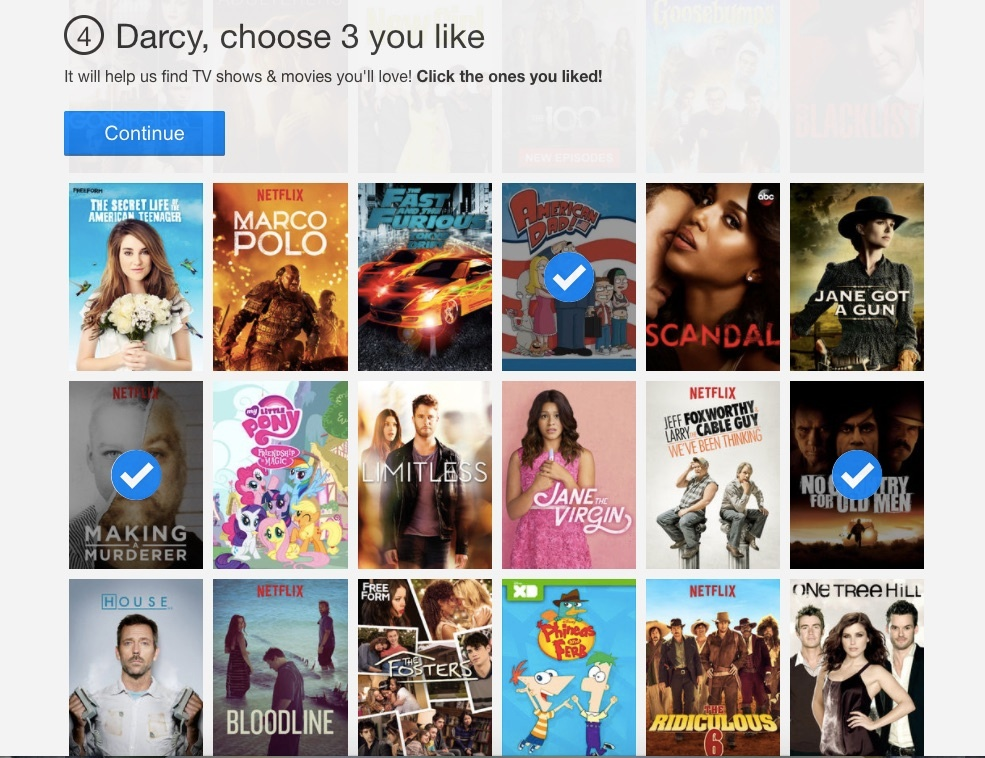
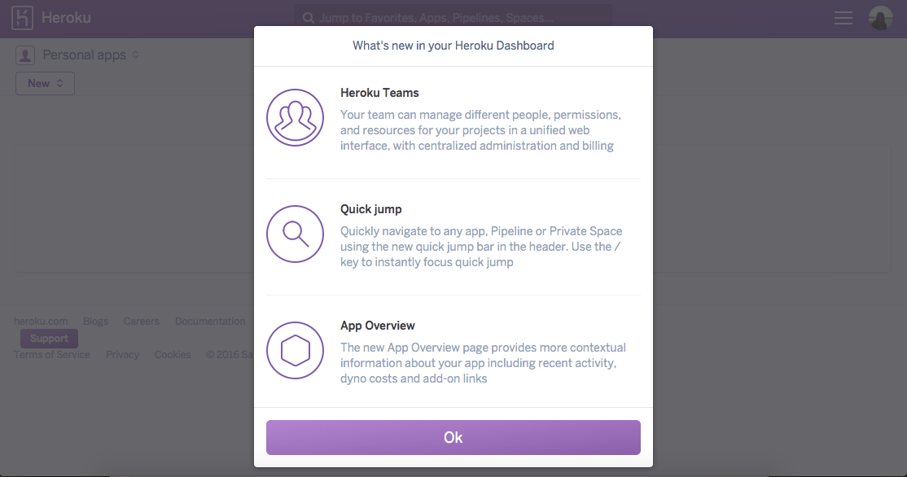

https://www.appcues.com/blog/the-dos-and-donts-of-in-app-notifications

# 用户提醒

有令一个叫法：应用内通知。一个不好的提醒可以让你的用户比你说的“垃圾邮件”更快地离开你的产品。一个好的通知可以给你的用户真正的价值和建立习连贯性操作。

如果这是提醒的潜在力量，为什么我们不使用它们来提供有意义的产品体验呢？因为提醒往往没有谨慎的在合适的时机显示。他们通常被认为是一次性和孤立的体验，而不是一个整体的沟通策略。结果是一系列的警告提醒降低了用户体验。

不好的提醒影响有多严重？

提醒对用户的伤害不仅仅是打扰了用户。在那 2-3 秒内(整个流程)，他们必须转移他们的注意力。提醒在错误的时间截走用户，比如他们正在工作或者休息的几分钟时间里。突然出现非个人的提醒给用户的感觉就像广告。

这就是为什么你需要花时间完善你的应用内消息传递策略的原因。

如果使用得当，应用内通知是围绕人们使用产品设计时候的扩展。他们根据用户的历史，行为，品味和时间表，以提供真正有价值的内容。他们可以教用户如何使用复杂的功能，给他们介绍给伟大的新事物，并帮助他们随着时间的推移进行互动。

让我们看看三个错误提醒的例子，并弄清楚如何将潜在的中断点变成有价值的时刻。

## 1. 非个人的欢迎页面

无区别地给用户群发消息不但得不到用户的重视，反而可能会降低他们对产品的喜爱，甚至离开。应用内通知是与您的用户建立联系的重要途径 - 以同理心使用它们，否则将会有浪费这个有价值途径的风险。

着陆页设计的困难。用户仅仅是打开应用开始尝试，并不意味着你已经获得了用户的喜爱。举一个 MailChimp 着陆页的例子：

用户直接被引入到仪表盘（功能总览），并伴随一个设置和用户支持方面的指导信息。这些说明并不应该是新用户第一步接触的。

现在 MailChimp 已经从用户引导和降低注册摩擦大大改善了其新用户的着陆体验。新用户被转移到一个干净的欢迎页面。

MailChimp 已经认识到用户第一次使用产品时的需求。他们不需要立即了解帐户设置。他们希望完成一项有意义的活动，这将帮助他们了解注册有没有价值，从而“建立产品的受众”。

### 深入理解用户

最好的消息让用户感觉应用程序完全是为他们而定制的。看看 Netflix 如何进行个性化。最棒的是它从新用户使用产品的那一刻就开始了。每个用户都有不同的体验，因为他们会立即被邀请选择他们的个人偏好。

每次用户与Netflix交互时，此个性化都会继续。随着用户观看的每个节目，他的登陆页面都会改变以反映该用户的偏好。

这种定制方法让用户感觉就像他们在Netflix上一样，他们只看到他们喜欢的精彩节目。这对品牌标识来说是一个巨大的好处。

## 2. 无目标的提示

无论你的信息如何精心制作和及时，如果它是针对错误的人，那就变得无稽之谈。这就像一个推销员谈论屋顶解决方案给一个独自在家的孩子，而不是等待房主。

从Heroku获取此通知，宣布新的仪表板：

虽然弹窗信息量大且易于阅读，方便介绍Heroku仪表板中的新功能，但它并没有为新用户提供太多价值。新用户尚未习惯仪表板中的旧功能 - 对他们而言，一切都是新的 - 而且信息几乎没有价值。

### 细分以提供额外的产品价值

应用内公告和教程必须特别针对用户。您可以使用提示来帮助您的用户从您的产品中获得更多收益，更多地了解他们自己的目标。如果提示目标不明确，用户可能会觉得您的通知都不会吸引他们并将其关闭，或者更糟糕的是，他们会怀疑他们使用了错误的产品来满足他们的需求。

AdRoll使用segmention提供有针对性的功能。他们知道有人单独使用MailChimp和AdRoll，因此他们提供了一个有用的窗口，用于询问，以期节省用户的时间。
