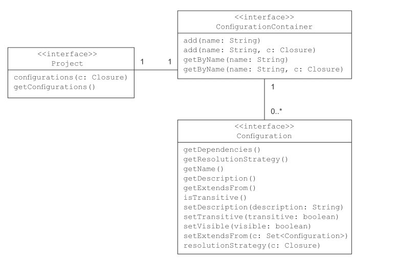
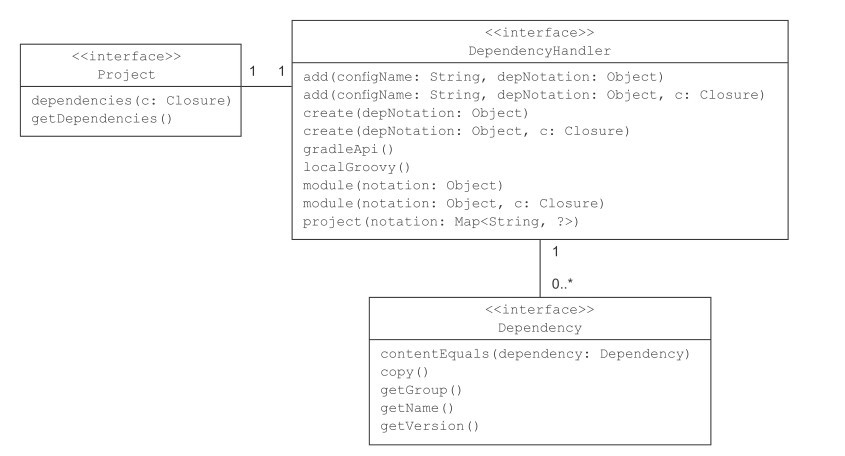

# Dependency Management

由于现代项目依赖的复杂性，不同依赖可能还有依赖，以及依赖于同一个库的不同版本等。想要通过手工维护依赖关系显然不太现实。自动化依赖维护工具诞生就是自动查找、比较依赖关系并自动加入到项目中。

为了实现依赖的自动查找，中央仓库必不可缺。Java 领域主要有两个包仓库:

Apache Ivy是一个纯粹的依赖管理器，主要用于Ant项目
Maven，它包含依赖项管理器作为其构建基础结构的一部分。


## 配置依赖

gradle 通过 `dependencies` 配置依赖，通过 `repositories` 配置仓库地址。 gradle 提供了各种配置对项目构建生命周期中所需的依赖。

依赖可以直接在项目的脚本的根级别添加和访问；可以使用插件所提供的配置，或者声明自己的配置。每个项目都有一个 ConfigurationContainer 类的容器来管理相应的配置。可以通过配置控制依赖解决方案中是否包含传递性依赖，定义解决策略，甚至可以使配置扩展。



Java 插件提供了 6 个现成的配置。

- implementation （替代 compile）
- compileOnly 添加编译时期的依赖，不在运行时使用。
- compileClasspath extends compile, compileOnly, implementation Compile classpath, used when compiling source. Used by task compileJava
- annotationProcessor 注解处理的阶段的依赖
- runtimeOnly 仅在运行时使用的依赖。
- runtimeClasspath 运行时类路径包含实现的元素以及仅运行时元素。

测试和调试的 
- debugImplementation
- androidTestImplementation
... 类似

### 声明依赖

depenpencies 将一个或多个依赖指配给配置，指派的外部仓库类库被称为外部依赖，外部依赖并不是项目声明的唯一依赖。 Gradle 可以指定的依赖有：

- 外部依赖：依赖仓库中的外部类库。

- 项目依赖：Gradle 可以是多项目（模块）的，项目之间可以依赖。如 `implementation project(':XXX')`
- 文件依赖：依赖文件系统中的一系列文件

- Gradle 运行时依赖：Gradle 脚本需要的依赖，在 `buildscript` 作用域中配置。

- 客户端模块依赖：以阿里仓库带外部类库，具有声明元数据的能力。

每个项目都有一个 DependencyHandler 实例来处理依赖。下表列出了它们之间的关系和方法。



#### 外部依赖

外部依赖通过不同的属性来唯一确定，当依赖管理器在仓库中查找一个依赖时，会通过属性组合来找到它。一个依赖至少需要提供一个名称。


- group: 此属性通常标识组织，公司或项目。 该组可以使用点符号，但不是强制性的。 对于Hibernate库，该组为org.hibernate。

- name: 工件的名称唯一地描述了依赖性。 Hibernate的核心库的名称是hibernate-core。

- version: 库可能有许多版本。 很多时候，版本字符串由主要版本和次要版本组成。 您为Hibernate core选择的版本是3.6.3-Final。

- classfiler: 有时工件会定义另一个属性分类器，该分类器用于区分具有相同组，名称和版本的工件，但是需要进一步说明（例如，运行时环境）。 Hibernate的核心库未提供分类器。

依赖的声明可以使用 map 的形式或者使用 `:` 分割的字符串形式。其本质是一样的。

Gradle 并没有提供一个默认的仓库。在没有配置仓库的相框下运行错误。需要指定仓库地址。

```gradle
repositories {
    jcenter()
}
```

当运行 dependencies 帮助 task 时，会显示完整的依赖树，依赖树显示了在构建脚本中声明的顶层依赖，以及它们的传递性依赖。
```shell
$ ./gradlew dependencies

> Configure project :
Description of project init_gradle: This is a test project
Reading the version file.
-------------- 0.12 ---------------

> Task :dependencies

------------------------------------------------------------
Root project - This is a test project
------------------------------------------------------------

cargo - Classpath path for Cargo Ant tasks.
\--- com.squareup.okhttp3:okhttp:4.9.0
     +--- com.squareup.okio:okio:2.8.0
     |    +--- org.jetbrains.kotlin:kotlin-stdlib:1.4.0 -> 1.4.10
     |    |    +--- org.jetbrains.kotlin:kotlin-stdlib-common:1.4.10
     |    |    \--- org.jetbrains:annotations:13.0
     |    \--- org.jetbrains.kotlin:kotlin-stdlib-common:1.4.0 -> 1.4.10
     \--- org.jetbrains.kotlin:kotlin-stdlib:1.4.10 (*)

(*) - dependencies omitted (listed previously)

```


### 自定义配置 Cargo 类库

