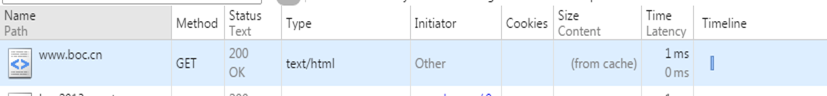

# 缓存

重复不变的内容减少或者避免重复请求。

缓存分为：

- 客户端缓： 用户本地缓存
- 服务器端缓存：
    - 代理服务器缓存：CDN 缓存。
    - 单项带阿里服务器缓存（也叫网关缓存，比如 Nginx 反向代理、 Squid 等。）

## 控制缓存的方式

1. HTML meta 标签。

```html
<meta http-equiv="pragram" content="no-cache"> 
禁止浏览器从本地缓存中调阅页面。 
网页不保存在缓存中，每次访问都刷新页面。 
<meta http-equiv="cache-control" content="no-cache, must-revalidate"> 
同上面意思差不多，必须重新加载页面 
<meta http-equiv="expires" content="0"> 
网页在缓存中的过期时间为0，一旦网页过期，必须从服务器上重新订阅。
```

2. HTTP 头信息。


浏览器缓存分为强缓存和协商缓存，浏览器加载一个页面的简单流程如下：

浏览器先根据这个资源的http头信息来判断是否命中强缓存。如果命中则直接加在缓存中的资源，并不会将请求发送到服务器。
如果未命中强缓存，则浏览器会将资源加载请求发送到服务器。服务器来判断浏览器本地缓存是否失效。若可以使用，则服务器并不会返回资源信息，浏览器继续从缓存加载资源。
如果未命中协商缓存，则服务器会将完整的资源返回给浏览器，浏览器加载新资源，并更新缓存。

> 强缓存

命中强缓存时，浏览器并不会将请求发送给服务器。在Chrome的开发者工具中看到http的返回码是200，但是在Size列会显示为(from cache)。


强缓存是利用http的返回头中的Expires或者Cache-Control两个字段来控制的，用来表示资源的缓存时间。


