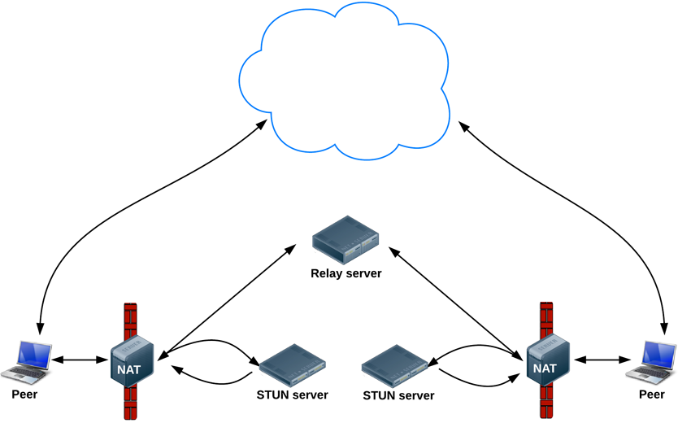

# 信令服务器

WebRTC 是为了建立点对点通信，为了设置和维持 WebRTC 呼叫，WebRTC 客户端（对等段）需要交换元数据。这些数据用于协调沟通。

- Candidate (network) information.
- Offer 和 answer 信息提供了媒体信息，例如分辨率和编解码。

也就说，在音视频或数据流可以发出之前，需要交换元数据。这个过程称为信令。

在之前的步骤中，发送和接受端的 RTCPeerConnection 对象在同一个应用中，信令只是在对象之间传递元数据的问题。

在真实应用中，发起和接受端 RTCPeerConnections 运行在不同的设备上，需要一种方法用于它们之间交换元数据。

由此，你需要信令服务器：可以在 WebRTC 客户端（对等端）之间传输信息的服务器。实际的消息就是纯文本:字符串化的JavaScript对象。


## 


WebRTC apps need to do several things:

- Get streaming audio, video, or other data.
- Get network information, such as IP addresses and ports, and exchange it with other WebRTC clients (known as peers) to enable connection, even through NATs and firewalls.
- Coordinate signaling communication to report errors and initiate or close sessions.
- Exchange information about media and client capability, such as resolution and codecs.
- Communicate streaming audio, video, or data.

To acquire and communicate streaming data, WebRTC implements the following APIs:

- MediaStream gets access to data streams, such as from the user's camera and microphone.
- RTCPeerConnection enables audio or video calling with facilities for encryption and bandwidth management.
- RTCDataChannel enables peer-to-peer communication of generic data.


## SDP

RTCSessionDescription objects are blobs that conform to the [Session Description Protocol](https://en.wikipedia.org/wiki/Session_Description_Protocol), SDP. Serialized, an SDP object looks like this:


```sample

```

The acquisition and exchange of network and media information can be done simultaneously, but both processes must have completed before audio and video streaming between peers can begin.


## RTCPeerConnection API plus servers

真实应用中，WebRTC 需要使用服务器。无论多简单的应用，都需要如下的过程。

- 用户发现彼此并交换真实世界中的信息，例如名字。

- WebRTC 客户端应用（对等端）交换网络信息。

- 对等端交换有关媒体的信息，例如视频格式和分辨率。

- WebRTC客户端应用程序穿越NAT(Network Address Translation，网络地址转换)网关和防火墙。

换而言之，WebRTC 需要四种类型的服务端能力：

In other words, WebRTC needs four types of server-side functionality:

- 用户发现和沟通。
- 信令
- NAT/防火墙穿透
- 对等通信失败时中继服务器

可以这么说，ICE框架使用STUN协议及其扩展TURN，使RTCPeerConnection能够处理NAT穿越和其他网络变化。

ICE是一个连接对等体的框架,比如两个视频聊天客户端。ICE 首先尝试通过 UDP 以可能的最低延迟直接连接对等体。在此过程中，STUN服务器只有一项任务：使NAT之后的对等方能够找到其公共地址和端口。 (有关STUN和TURN的更多信息，请参阅[构建WebRTC应用程序所需的后端服务。](https://www.html5rocks.com/en/tutorials/webrtc/infrastructure/))




由于 Peer 没有公共的 IP 地址，使用 NAT 协议分配一个 IP 地址。但是由于 NAT 协议仅存在于网关上，Peer 并不知道 NAT 转关的共有 IP。而只知道自习的私有 IP。但是如果请求发送到服务器，由于 NAT 公布的是共有 IP 地址。一次服务器知道 NAT 的共有 IP. 
1. Peer 向 SRUM 发送请求，询问 NAT 分配各自己的共有 IP 地址。

2. STUN 服务器将 Peer 的公开 IP 地址返回给 Peer。

3. 此时将 IP 地址发送给网络

如果 UPD 失败，ICE 尝试 TCP。如果由于企业NAT穿透和防火墙的原因导致直接连接失败，ICE使用一个中介(中继)转换服务器（TURN）。表述 ”查找候选（finding candidates）“ 就是指这整个查找网络接口和端口的过程。


## 多点连接

WebRTC 当前仅实现了点对点通信。但也可用于更复杂的网络场景，如多个对等体之间直接通信或通过[多点控制单元(MCU, Multipoint Control Unit)](https://en.wikipedia.org/wiki/Multipoint_control_unit)进行通信。可以处理大量参与者并进行选择性流转发以及音频和视频混合或录制的服务器。

but gateway servers can enable a WebRTC app running on a browser to interact with devices, such as telephones (also known as PSTN) and with VOIP systems. 


## 修改 index.js

```
var fs = require('fs');
var options = {
  key: fs.readFileSync('key.pem'),
  cert: fs.readFileSync('cert.pem')
};
var app = http.createServer(options, function(req, res) {
  fileServer.serve(req, res);
}).listen(80);
```