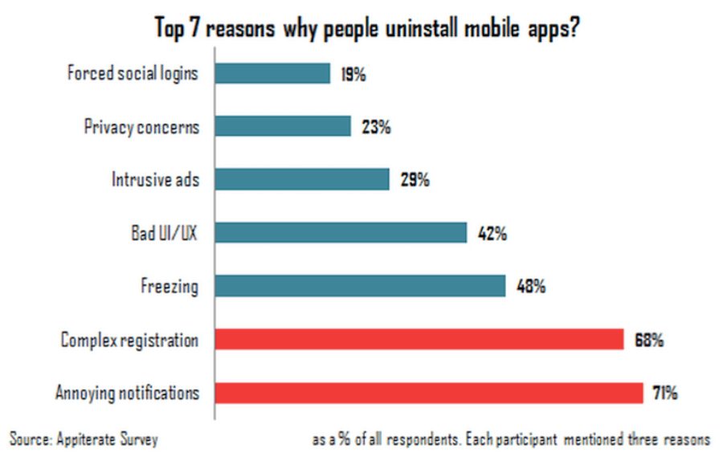

# Notification

## 用户体验设计

通知设计原则：
1. 通知内容必须是对用户来说是有价值的
2. 让用户知道推送的目的
3. 不要连续发送通知
4. 让用户更容易的关闭通知

通知功能是把利刃，使用得当，能够增加用户的活跃度和使用app的时间；使用不当会伤害用户体验，引起用户的反感，甚至引起用户卸载 app。

想象一下，如果你正在睡觉，一个通知响声将你吵醒，或者你正在专心工作，又或开会，一系列通知轰炸向你袭来，你还会喜欢给你提醒的 app 吗。通常我们会将手机调成静音，但是并不是每个人都会这样做，因为有些工作需要即时的回应通知和电话，垃圾通知对这些用户有着更大的伤害。



通知有两种主要类型：
- 必需的操作
- 被动的。

如标签所示，操作所需的通知要求用户根据通知中收到的信息进行操作。被动通知只是提供信息。大多数推送通知都是被动的。

### 良好用户体验的推送守则

#### 1. 个性化定制




### 通知推送中容易出现的错误

1. 在 app 首次安装启动的时候请求用户允许通知
2. 没有告诉用户通知将包含的信息内容
3. 频繁的发送通知
4. 发送无关内容
5. 关闭通知非常困难

#### Mistake1: 在第一次安装启动之后就立即要求用户允许通知

刚下载的用户还没有感觉到 app 能够给他们提供什么价值，app 也没有得到用户的充分信任，就弹窗询问用户是否接收通知。调查显示，很多用户连提示内容就不会读，就会直接点击“不接收”。想要用户授权一些信息，或者整提醒接收通知，app 应该让用户先体验，给用户提供价值。然后才询问用户是否接收通知。

#### Mistake2: 没有告诉用户通知的内容是什么

在询问用户是否接收通知时，最好能够给出通知将会给用户提供什么，而不是仅仅告诉用户信息要求用户授权的内容。毕竟仅说需要什么授权/表现，会让用户觉得，公司将会从用户那得到什么，而不是用户将得到什么信息。详细的说明能够让用户知道他们是否需要这些消息。并提高应用程序可靠性和可信度的用户感知。

告诉用户通知将包含的内容能够增加用户接受的机率。

#### Mistake3：以爆发式发送通知

在短时间内接收到许多通知可能会压倒和激怒用户，导致他们关闭通知（或者更糟的是，删除您的应用程序）。更不用说，重复的通知可能显得草率和不专业，甚至可能是需要的，给您的用户留下持久的负面印象。

避免在短时间内发送大量通知，不要用几个通知填满用户的屏幕，而是用有意义的方式发送更少的通知。如果您有五个以上的通知需要一次发送，请将它们合并为一条消息。把重点转移到质量而不是数量上，你一定会看到用户满意度的提高。


#### Mistake4：共享无关内容

任何通知都会打断用户：这是为了引起我们的注意，并将其引导到通知中。当我们能够从通知中得到的价值大于被中断的工作时，我们并不介意；但当信息与我们无关时，打扰是令人恼火的。有些人喜欢将收件箱保持在零条未读信息，另一些人则喜欢手机的锁屏上没有通知。如果您属于后一组，那么清除不相关的通知就显得特别耗时和麻烦。

向用户发送应用程序中发生的每一件小事的通知都是一个很大的错误。你不想成为一个应用程序，让你的用户在任何时候屏幕上弹出一个通知时都会翻白眼。你也不应该通过说“好吧，他们可以在设置中关闭他们”来证明这种行为是正当的，相反，提供相关的内容来通知和参与。


#### Mistake5：使关闭通知变得困难
用户决定关闭通知的原因有很多：
- 他们收到的通知太多了。
- 你的内容对他们来说没有以前那么重要。
- 他们发现自己分心了。
无论原因是什么，您都不应该试图对用户隐藏此功能。这种做法具有欺骗性，会降低对公司和应用程序的信任，并为用户提供删除应用程序的更多理由。
关闭应用程序通知应该简单快捷。允许用户在应用程序中编辑他们的通知首选项，这样他们就不会被强制转到手机的本地设置。此外，将此功能放在应用程序的“设置”部分，以满足用户的期望并确保可查找性。

[Five Mistakes in Designing Mobile Push Notifications](https://www.nngroup.com/articles/push-notification/)
## 前提条件

- Android 的通知会先分配给App, App 再控制通知显示的样式：是否现在状态栏，是否在屏幕悬浮显示，图标，样式，只是灯等。
- Android8.0 (API26)开始，增加了分类（channel）功能，用户可以自定义分类来分别设置通知，以及将不同通知放到一个分类中，设置将对该组通知同时生效。

- target API 必须是26或者更高，否则会显示的跟26之前版本一样。

## 申请

- 必须 8.0 之上才成申请分类(Channel)。
```
mNotifyManager = (NotificationManager)
       getSystemService(NOTIFICATION_SERVICE);
     if (android.os.Build.VERSION.SDK_INT >=
                                  android.os.Build.VERSION_CODES.O) {
     // Create a NotificationChannel
     }
}
```

- 分类是以字符串作为 id 标识的。
```
private static final String PRIMARY_CHANNEL_ID = "primary_notification_channel";

// Create a NotificationChannel
NotificationChannel notificationChannel = new NotificationChannel(PRIMARY_CHANNEL_ID,
       "Mascot Notification", NotificationManager
       .IMPORTANCE_HIGH);
```

- 分类可以设置各种通知效果

```
public void createNotificationChannel(String chanelId, String name, String desc) {
    mNotifyManager = (NotificationManager)
            getSystemService(NOTIFICATION_SERVICE);
    if (android.os.Build.VERSION.SDK_INT >= android.os.Build.VERSION_CODES.O) {
        // Create a NotificationChannel
        NotificationChannel notificationChannel = new NotificationChannel(
                chanelId, name, NotificationManager.IMPORTANCE_HIGH);
        notificationChannel.enableLights(true);
        notificationChannel.setLightColor(Color.RED);
        notificationChannel.enableVibration(true);
        notificationChannel.setDescription(desc);
        mNotifyManager.createNotificationChannel(notificationChannel);
    }
}
```

## 创建一个 Notification

```
private NotificationCompat.Builder getNotificationBuilder() {
    Intent notificationIntent = new Intent(this, MainActivity.class);
    PendingIntent notificationPendingIntent = PendingIntent.getActivity(this,
            NOTIFICATION_ID, notificationIntent, PendingIntent.FLAG_UPDATE_CURRENT);
    NotificationCompat.Builder notifyBuilder = new NotificationCompat.Builder(this, PRIMARY_CHANNEL_ID)
            .setContentTitle("You've been notified!")
            .setContentText("This is your notification text.")
            .setSmallIcon(R.drawable.ic_android)
            .setContentIntent(notificationPendingIntent)
            .setAutoCancel(true) // 点击自动消失
            .setPriority(NotificationCompat.PRIORITY_HIGH)
            .setDefaults(NotificationCompat.DEFAULT_ALL);
    return notifyBuilder;
}

public void sendNotification(View view) {
    NotificationCompat.Builder notifyBuilder = getNotificationBuilder();
    mNotifyManager.notify(NOTIFICATION_ID, notifyBuilder.build());
}

```

Content intents for notifications are similar to the intents you've used throughout this course. Content intents can be explicit intents to launch an activity, implicit intents to perform an action, or broadcast intents to notify the system of a system event or custom event.

The major difference with an Intent that's used for a notification is that the Intent must be wrapped in a PendingIntent. The PendingIntent allows the Android notification system to perform the assigned action on behalf of your code.


## 8.0 之前显示效果

Priority is an integer value from PRIORITY_MIN (-2) to PRIORITY_MAX (2). Notifications with a higher priority are sorted above lower priority ones in the notification drawer. HIGH or MAX priority notifications are delivered as "heads up"（就是弹屏通知） notifications, which drop down on top of the user's active screen. It's not a good practice to set all your notifications to MAX priority, so use MAX sparingly.


```
final NotificationManager manager =(NotificationManager) getSystemService(Context.NOTIFICATION_SERVICE);
PendingIntent pendingIntent = PendingIntent.getActivity(this, 0, new Intent(), PendingIntent.FLAG_UPDATE_CURRENT);
Notification notify= null; // 需要注意build()是在API level16及之后增加的，在API11中可以使用getNotificatin()来代替
Notification.Builder builder = new Notification.Builder(this)
        .setSmallIcon(R.drawable.nav_arrow_back) // 设置状态栏中的小图片，尺寸一般建议在24×24， 这里也可以设置大图标
        .setLargeIcon(BitmapFactory.decodeResource(getResources(), R.drawable.ic_launcher))
        .setTicker("12345678912378912356789")// 设置显示的提示文字
        .setContentTitle("12345678912378912356789")// 设置显示的标题
        .setContentText("12345678912378912356789")// 消息的详细内容
        .setContentIntent(pendingIntent) // 关联PendingIntent
//                .setFullScreenIntenmomt(pendingIntent, false)

        .setNumber(1); // 在TextView的右方显示的数字，可以在外部定义一个变量，点击累加setNumber(count),这时显示的和

if (Build.VERSION.SDK_INT >= Build.VERSION_CODES.O) {
    manager.createNotificationChannel(new NotificationChannel("gholl","gholl", NotificationManager.IMPORTANCE_HIGH));
    notify = builder.setChannelId("gholl").setColor(Color.GREEN).build();
}else {
    notify = builder.getNotification();
}
notify.flags |= Notification.FLAG_AUTO_CANCEL;
manager.notify(1, notify);
//        manager.notify(-1, notify);
//        TimerTask task = new TimerTask() {
//            @Override
//            public void run() {
//                manager.cancel(-1); // 根据之前设置的通知栏 Id 号，让相关通知栏消失掉
//            }
//        };
//        Timer timer = new Timer();
//        timer.schedule( task , 2000);
```
