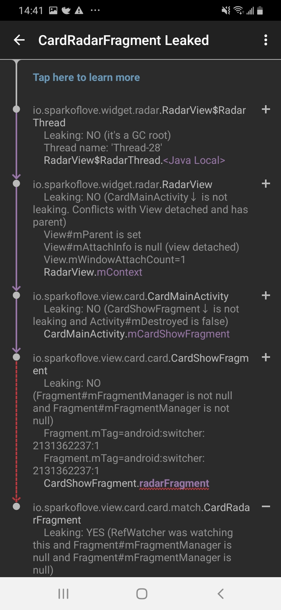

# OOM 引起问题和解决方案

添加 leakcanary 的依赖。2.0 版本做了一些改动，只需要添加依赖就能自动向项目中注入代码，不用再在 application 中开启检测。

```
debugImplementation 'com.squareup.leakcanary:leakcanary-android:2.0-alpha-3'
```

此时只会在 debug 版本中添加检测，其他版本都不会添加加测。测试发现 `debugImplementation` 是和 `buildTypes` 中的分渠道打包名关联的。

```
buildTypes {
        debug {
           ...
        }

        product {
            ...
        }

        pre_relese {
            ...
        }

        release {
            ...
        }
    }
```

因此，想要添加 `product` 版本的检测，需要添加。这在官方文档上并没有提到。

```
    productImplementation 'com.squareup.leakcanary:leakcanary-android:2.0-alpha-3'

```

leakcanary 对混淆敏感，混淆会导致其无法启动，也没有在官网上找到取消混淆的文档，这个可以理解，在 release 版本上带 leakcanary 的需求本身就很奇怪。


## 内部类

在使用过程中，内部类本身持有外部类的应用，所以才可以调用外部类的非静态方法。如果内部类的声明周期比外部类长，就会导致外部类占用的内存无法释放。Java 中内部类默认是费静态的，引用更普遍，在 Kotlin 做了改进，默认是静态内部类。 

```Java
public class CardMainActivity extends BaseActivity {
    public class CardMainHandler extends Handler {
        @Override
        public void handleMessage(Message msg) {
            // 不用声明变量，内部类就持有外部类的引用，所以才能自由访问外部类的非静态变量和方法。
            mViewModel.getMatchUsers(null);
        }
    }
```

此时 `CardMainHandler` 是非静态的，自然而然持有外部对象的引用。 此时如果内部类生命周期比外部类长，外部类就无法释放。

```Java
//registerNetReceiver();
((DatingApplication) getApplication()).setCardMainHandler(new CardMainHandler());
```

解决方案： 使用 Activity 销毁时自动解绑的 LiveData 或者 EventBus 处理页面直接的事件传递。禁止使用全局 application 传递事件。

## 静态内部类

静态内部类虽然没有外部类对象的引用，但是却有类的引用，用于访问外部类的静态方法。此时如果外部类声明了静态变量，在静态内部中使用了，也不容易释放掉。这种方式是：1，没有明确的包含关系，少用内部类。2，除了常量和单例，谨慎使用静态变量。




## 自定义线程

无论是多线程还是多进程，在编程中都是一个难点。在页面退出后，线程没有销毁非常普遍。

关于自定义线程解决的方法多种多样，不同的场景需要使用不同的方式。这里进列举现在遇到的。

1. 一个常见的使用线程的地方就是动画，动画需要在单独的线程计算，然后在 UI 线程中更新 UI。 关于动画的部分，建议使用 Android 更好封装的属性动画。它会在 UI 销毁时，及时的销毁，而不必关系终止问题。

下面是 RadarView 的线程计算动画执行过程

```Java
    private static class RadarThread extends Thread {
        private WeakReference<RadarView> weakReference;

        public RadarThread(RadarView radarView) {
            weakReference = new WeakReference<>(radarView);
        }

        @Override
        public void run() {
            super.run();

            RadarView radarView = weakReference.get();
            if (radarView != null) {
                radarView.beginRunning();
            }
        }
    }

    /**
     * 开始运行
     */
    private void beginRunning() {
        while (threadIsRunning) {
            RadarView.this.post(new Runnable() {
                @Override
                public void run() {
                    start = start + 1;
                    matrix.setRotate(start, 0, 0); //因为我对画笔进行了平移，0，0表示绕圆的中心点转动
                    RadarView.this.invalidate();
                }
            });
            try {
                Thread.sleep(5);
            } catch (InterruptedException e) {
                e.printStackTrace();
            }
        }
    }

```

改为系统组件更简单，而且可调节的更多。会在 UI 销毁时，将其一块销毁。

```Java
    public void start() {
        if (mRotateAnim != null && mRotateAnim.isRunning()) {
            return;
        }
        mRotateAnim = ObjectAnimator.ofInt(this, "rotate", start + 360) // 360 度
                .setDuration(2000);
        mRotateAnim.setRepeatMode(ValueAnimator.RESTART);
        mRotateAnim.setRepeatCount(Animation.INFINITE);
        mRotateAnim.setInterpolator(new LinearInterpolator());
        mRotateAnim.start();
    }
```

2. 在 View 组件销毁的时候，将线程终止掉。很麻烦的一点是， Java 的线程没有提供直接终止的方法，一般是单独设置一个标志位，在线程中判断标志位，终止执行。

```
    private static class RadarThread extends Thread {
        @Override
        public void run() {
            if (continue) { // 要判断的标志位
                // ...
            }
        }
    }
```

这种方式并不太好，能不直接使用线程还是避免使用线程，太原始了。深入掌握线程非常重要，但不一定非要处处使用，仿佛一下从机械时代回到了农耕时代。

 

## 待研究

Fragment 是否需要持有引用，或者如何销毁。


