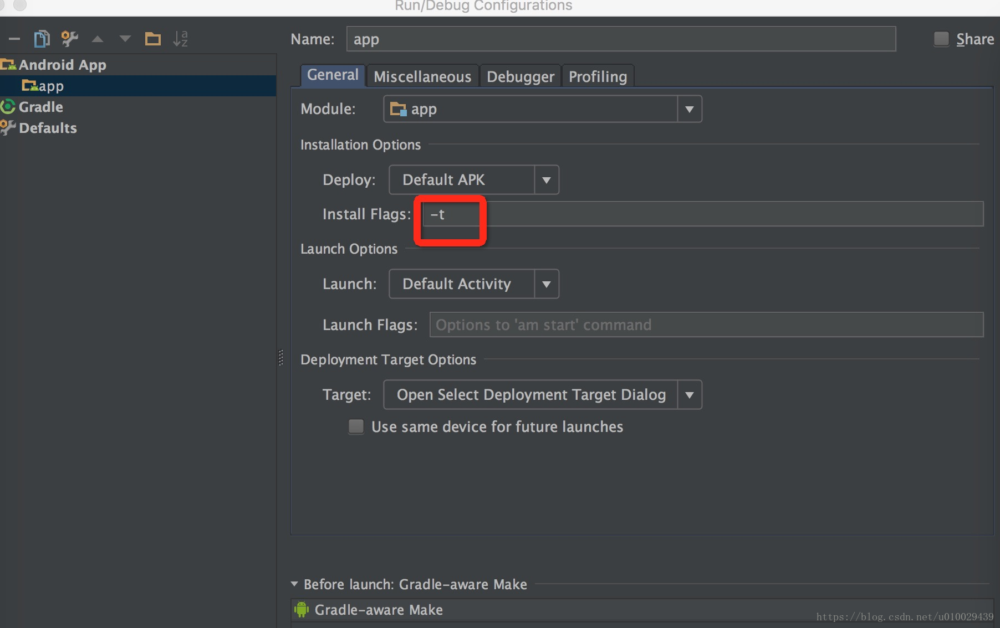

# 一些配置的含义

```
android.injected.testOnly=false
```

更好的方法是设置安装参数。



但是在部分手机上这个参数并不起作用，例如 `realme x30`。

Android Studio 3.0会在debug apk的manifest文件application标签里自动添加 android:testOnly="true"属性，导致IDE中run跑出的apk在大部分手机上只能用adb install -t <apk>来安装，或者在部分手机上安装出错 `INSTALL_FAILED_TEST_ONLY`。

解决办法是在 `gradle.properties` 中添加 `android.injected.testOnly=false` 

`AndroidManifest.xml` 文件可以添加一个 `android:testOnly` 属性，这个标志能够在 `PackageManager` 和 `ApplicationInfo` 的 `FLAG_TEST_ONLY` 属性获得。这个属性从 API 4 就有了。它用于标识这个 Apk 用于测试，仅能使用 `adb -t` (INSTALL_ALLOW_TEST flag) 安装。 但是从 Android 3.0 手机开始 IDE 会在安装 apk 时自动添加这个标志位。

https://commonsware.com/blog/2017/10/31/android-studio-3p0-flag-test-only.html