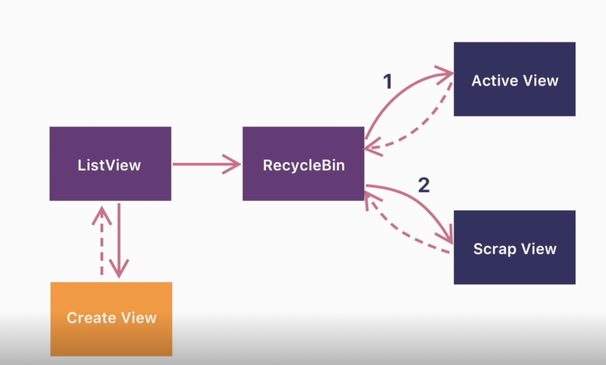
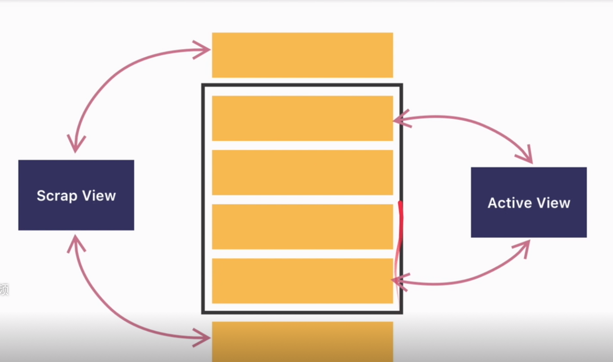
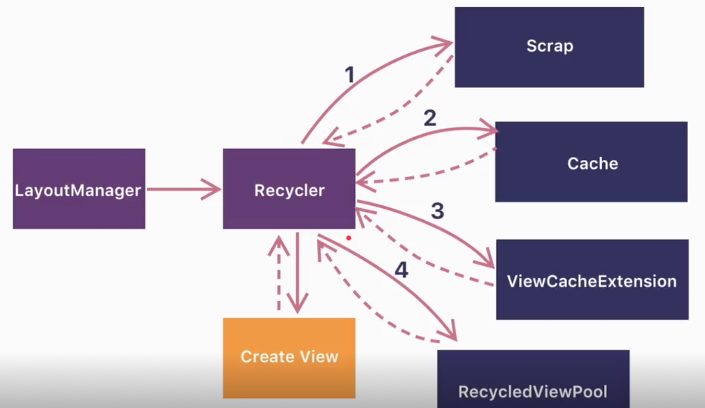
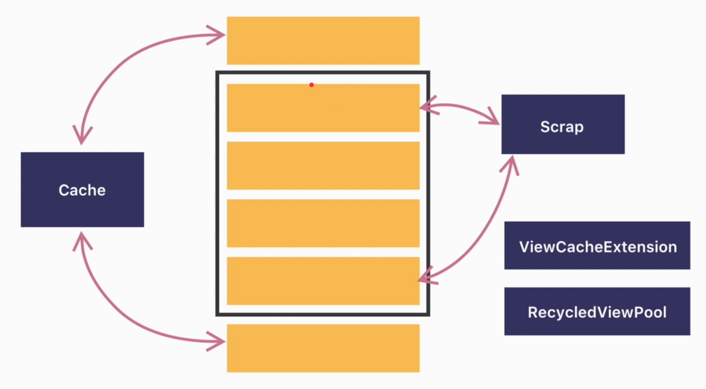
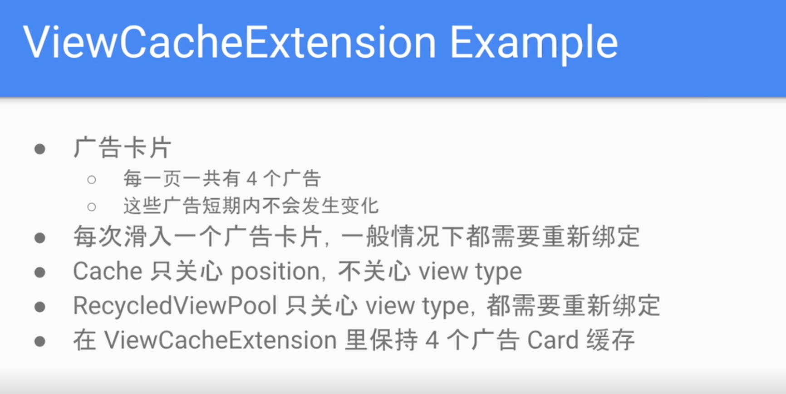
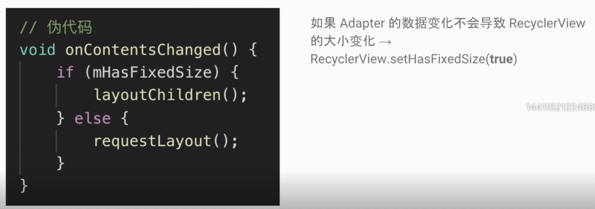
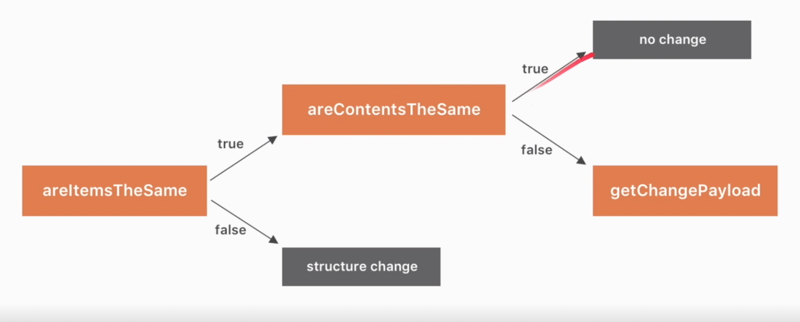

[TOC]

# RecyclerView

一个在有限屏幕空间，展示 `大量数据列表` 的 `灵活` 的组件。

> 大量数据列表

- 复用 Item

> 灵活

- 展示不同形式的列表
- 不同 Item 可以不同


> ListView 的局限

- 只能显示纵向列表，不能实现表格布局，流式布局
- 没有支持动画的 API
- 接口设计和系统不一致
    - setOnItemClickListener()
    - setOnItemLongClickListener()
    - setSelection()
    - 这些接口和系统的组件的 onClickListener 是重复的，这样就很混乱，也容易引起人们的困惑。
- 没有强制实现 ViewHolder
- 性能不如 RecyclerView, 需要自己手写复用回收的代码


> RecyclerView 的优势

- 默认支持 Linear, Grid, Staggered Grid 三种布局，并且都有水平和竖直两个方向。
- 友好的 ItemAnimator 动画 API
- 强制实现 ViewHolder
- 解耦的架构设计
- 相对 ListView 更好的性能

 

## RecyclerView 使用

架构组件

- RecyclerView: 总的容器
- LayoutManager: 布局和摆放 Item, 计算 Item View 的位置
- Item Animator: 控制 Item 的动画
- Adapter: 提供显示的 item View

### 分割线


### 


## RecyclerView.ViewHolder 究竟是什么
用户保存 View 引用的容器类， 把需用用到的 View (findViewById 拿到的。深度优先查找，O(n)) 都缓存起来。
- 和 ItemView 什么关系？
    意义对应关系，一个 ItemView 对应一个 ViewHolder
- 解决什么问题
    解决重复 findViewById 来提高效率。
- ViewHolder 和 ListView 的 ItemView 复用有什么关系？
    需要自己选择是否实现 ViewHolder。一个 ItemView 就绑定一个 ViewHolder, 一对一的绑定，优化重复 findViewById 的问题。


另外还保存了位置信息


## RecyclerView 的缓存机制

> ListView 的缓存



通过 RecycleBean 实现回收的管理。RecycleBean 有两层缓存。第一层是 Active View，活跃的，滑动时用户能够看到的 View 的列表， 第二层是 Scrap View。划出屏幕，别回收的 View。 当需要一个 View 时，会首先在第一层里面找，找不到才会在第二层里面找。如果都没找到，则会返回 null, 也就是在 getView 中需要自己创建新的 item view 的时机。




Active View 复用是在屏幕刷新的时候，会先清空，然后从从新获取要绘制的内容，这时候就从 Active View 获取，绘制。这时候由于数据、Item、尺寸都完全一样，所以会直接绘制，不会调用 getView方法。



使用 Recycler 来管理缓存，具有四层的缓存。缓存的是 ViewHolder。 

- 与 ListView 不同，Scrap 是屏幕内显示的第一层缓存。
- cache 是刚划出的，数据还没有变化的 item 的缓存，它是通过 position 来查找。这样的好处是，如果反向滑动，这时候 cache 的缓存可以直接拿过来用，而不用从新绑定数据。 所以 cache 跟 scrap 更像。 （RecyclerView 的 cache + scrap <----> ListView 的 ActiveView）
- 第三层 ViewCacheExtension 是用户自定义的缓存策略。用户没有定义的时候，将跳过。
- RecycledViewPool. 标记数据为脏数据的 Item, 通过 ViewType 来查找，需要从新绑定数据。

都查找不到，就调用 adapter 的 onCreateViewHolder 创建一个。



ViewCacheExtension 极少使用得到，下面是一个假象的场景。



> 注意: 列表中 item/ 广告的 impression 统计

ListView 是使用 getView 来统计展示的次数。但是 RecyclerView 的 onBindViewHolder 的调用次数，可能会比实际展示。 通过 onViewAttatchedToWindow（） 来统计次数。


## RecyclerView 的性能优化策略

> 1 点击监听器的创建

滑动时创建，和回收，会造成内存抖动。所以不要再 onBindViewHolder 中创建、设置监听器，而是在创建的时候， ViewHolder 中，或者全部的 Item 使用同一个 listener。

> 2 LinearLayoutManager.setInitialPrefetchItemCount()

- 在既能横向滑动，又能纵向滑动的时候。比如在纵向列表中插入了横向列表。当滑动到具有横向列表的 Item 的时候，由于要创建复杂的横向列表，可能会导致页面卡顿。
- 5.0 以上，由于 RenderThread 的存在（单独的 UI 线程），RecyclerView 会进行 prefetch。
- LinearLayoutManager.setInitialPrefetchItemCount(横向列表初次显示时，可见的 item 个数)
    - 只有 LinearLayoutManager 有
    - 只有嵌套到内部的 RecyclerView 才有用。


> 3. RecyclerView.setHasFixedSize()



当 RecyclerView 的 item 数量发生变化时，会导致调用 requestLayout 来从新布局，和绘制。这是一个很重的造作。如果一下操作，如替换，和能改数据，不会引起 item 的数量发生变化时，可以将 hasFixedSize 设置为 true, 就会只走 layoutChilder() 的逻辑。从而优化性能。


> 4 多个 RecyclerView 共用 RecyclerdViewPool

当多个 RecyclerView 的 ItemView 一样或者有部分 item 一样的时候，可以设置共用一个缓存池。

```kotlin
val viewPool = RecyclerView.RecycledViewPool()
recyclerView1.setRecycledViewPool(viewPool)
recyclerView2.setRecycledViewPool(viewPool)
recyclerView3.setRecycledViewPool(viewPool)
```


> 5 DiffUtil 

- 局部更新方法 notifiItemXXX() 不适用与所有情况，插入，删除和批量处理
- notifyDataSetChange() 会导致整个布局重绘，重新绑定所有的 ViewHolder, 而且会失去可能的动画效果。
- DissUtil 使用与整个页面需要刷新，但是有部分数据可能相同的情况。

使用的是 Myers Diff Algorithm。 动态规划，比较两个列表的




在列表数据很大是，使用异步处理来回调显示。 谷歌提供了 AynycListDiffer(Executor) / ListAdapter。

代码示例

https://developer.android.com/reference/androidx/recyclerview/widget/AsyncListDiffer

https://developer.android.com/reference/androidx/recyclerview/widget/ListAdapter


## 为什么 ItemDecoration 可以绘制分割线。

分割线尽量不要使用 View 或背景来代替，一是影响性能，最主要的是影响扩展，做动画的时候，分割线会跟着 Item 动，这个很难受。

使用场景
- 分割线
- HightLight(高亮)，例如选中的图片加蒙板
- Visual grouping boundaries 分组

***可以添加多个，效果进行叠加。***


### 更多知识

添加 header, footer，动画等

https://github.com/h6ah4i/android-advancedrecyclerview

https://advancedrecyclerview.h6ah4i.com/


### 默认实现

DividerItemDecoration


### 替换 ViewPager

https://blog.csdn.net/u012854870/article/details/84984066


> Android RecyclerView.ViewHolder # getAdapterPosition() 返回 -1 的原因与处理方案。

使用 getLayoutPosition 代替

https://www.jianshu.com/p/17080a269dfe


### RecyclerView 消耗点击事件

点击

recyclerView.setLayoutFrozen(true)
